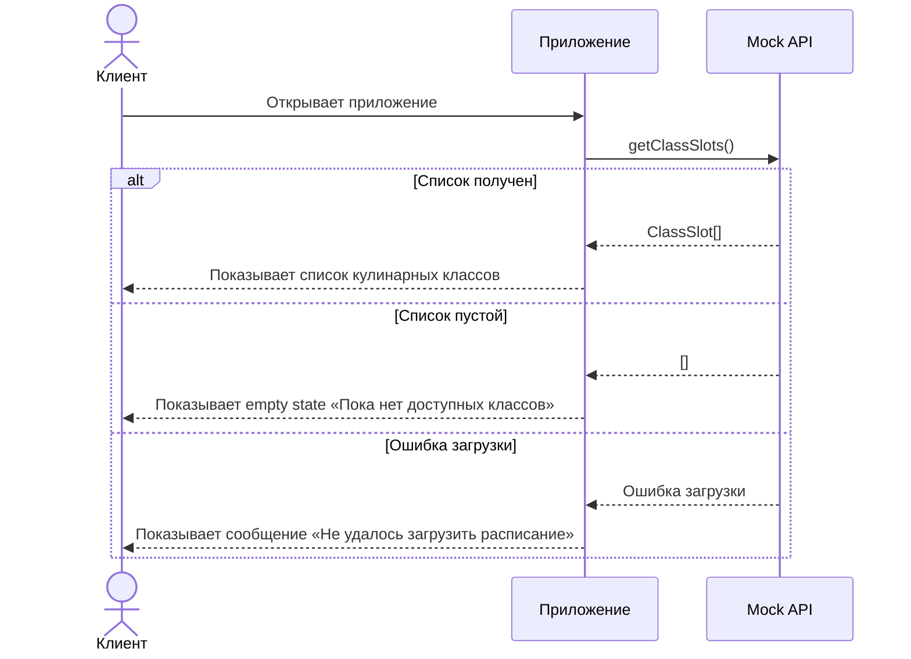
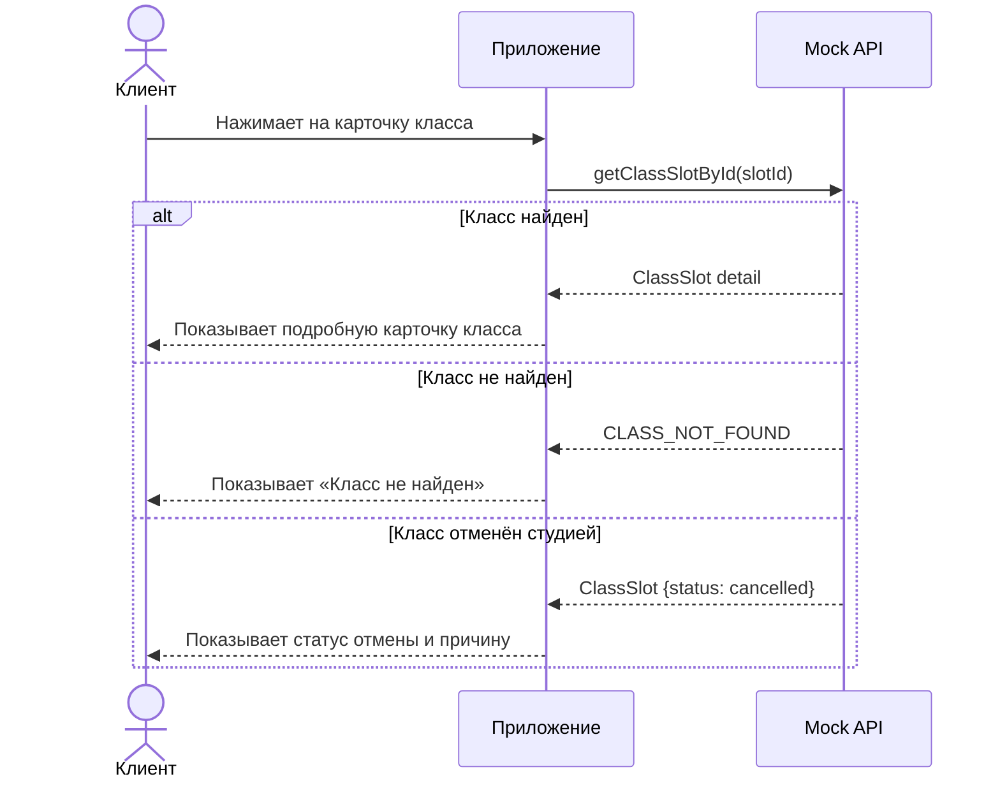
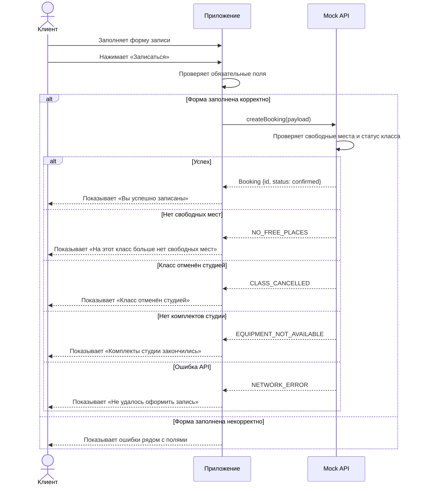
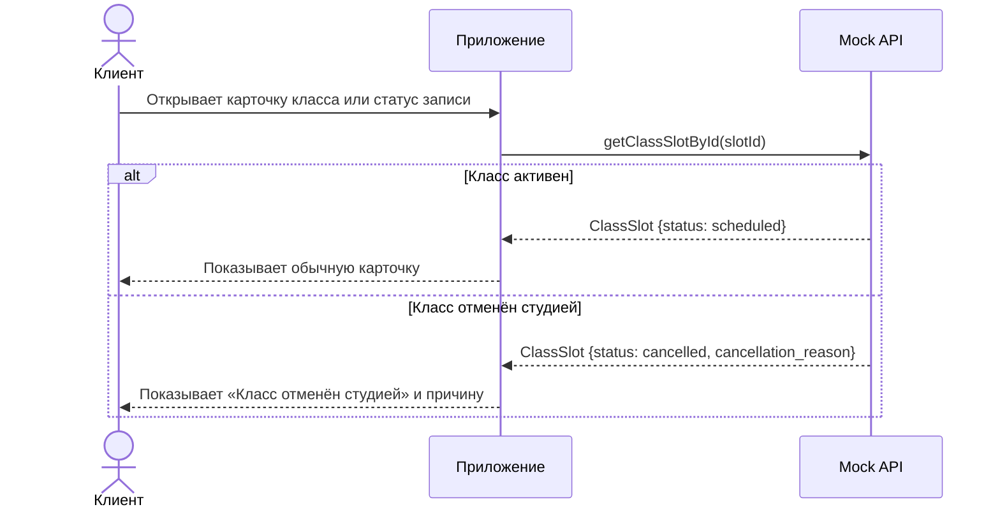
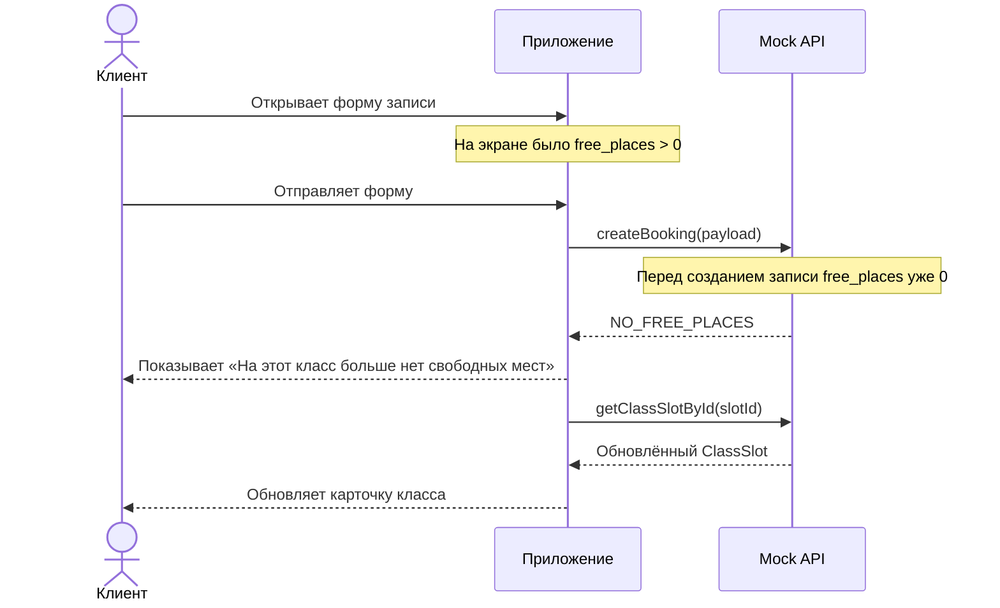

# Sequence-диаграмма API-взаимодействия

> Этап 3. Проектирование. Как клиентское приложение и API обмениваются вызовами
> в критичных сценариях записи на кулинарный класс.
>
> **Скоуп: клиентское приложение и API для него.**
>
> В реальном продукте клиентское приложение получает расписание, карточки классов,
> свободные места и статусы записей из существующего бэкенда.
>
> В учебной реализации настоящий бэкенд не поднимается: API-вызовы имитируются в `app.js`
> через mock API и тестовые данные.

---

## Сквозные правила взаимодействия

- Клиентское приложение не создаёт и не редактирует расписание, программы классов и данные шефов.
- Существующий бэкенд является источником истины по свободным местам, статусам слотов и статусам записей.
- В учебной реализации эти проверки имитируются в `app.js`.
- Клиент не должен успешно создать запись, если свободных мест нет.
- Если класс отменён студией, запись не удаляется, а получает отдельный статус `cancelled_by_studio`.
- Ошибки API показываются клиенту понятным текстом без технических деталей.
- Мутации в учебном MVP выполняются только через mock API, а не напрямую через изменение интерфейса.

---

## Сценарий 1: Получение списка кулинарных классов

Поток: клиент открывает приложение → приложение запрашивает список классов →
API возвращает доступные слоты → приложение показывает карточки занятий.

В реальном продукте условный вызов:

```http
GET /client/class-slots
```

В учебной реализации:

```js
api.getClassSlots()
```



| Шаг | Что происходит | Комментарий |
| :-- | :-- | :-- |
| Запрос | Приложение вызывает `getClassSlots()` | В реальном продукте это был бы запрос к API |
| Успех | Возвращается список `ClassSlot[]` | Клиент видит карточки классов |
| Пустой ответ | Возвращается пустой массив | Показывается понятное пустое состояние |
| Ошибка | Данные не получены | Показывается сообщение об ошибке |

---

## Сценарий 2: Просмотр карточки класса

Поток: клиент выбирает занятие из списка → приложение запрашивает подробности →
API возвращает данные программы, шефа, времени, цены и свободных мест.

В реальном продукте условный вызов:

```http
GET /client/class-slots/{slotId}
```

В учебной реализации:

```js
api.getClassSlotById(slotId)
```



| Шаг | Что происходит | Комментарий |
| :-- | :-- | :-- |
| Запрос | Приложение вызывает `getClassSlotById(slotId)` | Используется выбранный `slotId` |
| Успех | Возвращается подробная карточка класса | Показываются программа, шеф, цена, места, адрес |
| Не найдено | Возвращается `CLASS_NOT_FOUND` | Клиент видит понятную ошибку |
| Отмена студией | Возвращается слот со статусом `cancelled` | Кнопка записи недоступна |

---

## Сценарий 3: Создание записи на класс

Поток: клиент открывает форму записи → вводит данные → приложение проверяет обязательные поля →
отправляет данные в API → API создаёт запись или возвращает ошибку.

В реальном продукте условный вызов:

```http
POST /client/bookings
```

В учебной реализации:

```js
api.createBooking(payload)
```

Клиент отправляет:

```json
{
  "slot_id": "slot_001",
  "client_name": "Анна",
  "client_phone": "+7 900 000-00-00",
  "client_email": "anna@example.com",
  "participants_count": 1,
  "allergy_comment": "Аллергия на орехи",
  "equipment_type": "studio",
  "comment": "Буду впервые на мастер-классе"
}
```



| Шаг | Что происходит | Комментарий |
| :-- | :-- | :-- |
| Проверка формы | Клиентское приложение проверяет имя, телефон и количество участников | Если есть ошибки, запрос не отправляется |
| Запрос | `createBooking(payload)` | В учебной реализации это mock API |
| Проверка мест | API проверяет `free_places` | В реальном продукте это делает бэкенд |
| Успех | Возвращается `Booking` со статусом `confirmed` | Клиент видит подтверждение |
| Ошибка мест | Возвращается `NO_FREE_PLACES` | Запись не создаётся |
| Ошибка комплекта | Возвращается `EQUIPMENT_NOT_AVAILABLE` | Если клиент выбрал комплект студии |
| Ошибка отмены | Возвращается `CLASS_CANCELLED` | Если класс отменён студией |

---

## Сценарий 4: Отображение отмены класса студией

Поток: студия отменяет класс во внешней системе → клиентское приложение получает слот со статусом
`cancelled` → запись клиента отображается как отменённая студией.

В учебном MVP отмена студией не выполняется через интерфейс клиента. Клиент только видит результат.



| Шаг | Что происходит | Комментарий |
| :-- | :-- | :-- |
| Запрос | Приложение получает данные слота | Клиент не отменяет класс сам |
| Статус `scheduled` | Класс доступен | Можно открыть карточку и записаться, если есть места |
| Статус `cancelled` | Класс отменён студией | Запись недоступна, причина показывается клиенту |

---

## Сценарий 5: Ошибка «мест нет» при одновременной записи

Этот сценарий нужен, потому что клиент мог открыть форму, пока места ещё были,
но к моменту отправки формы свободные места уже закончились.



| Шаг | Что происходит | Комментарий |
| :-- | :-- | :-- |
| Клиент открыл форму | На момент открытия места были | Данные могли устареть |
| Отправка формы | Приложение вызывает `createBooking(payload)` | Финальная проверка выполняется API |
| Ошибка | Возвращается `NO_FREE_PLACES` | Запись не создаётся |
| Обновление | Приложение повторно получает данные слота | Клиент видит актуальное состояние |

---

## Коды ошибок

| Код | Когда возникает | Что видит клиент |
| :-- | :-- | :-- |
| `CLASS_NOT_FOUND` | Класс не найден | «Класс не найден» |
| `NO_FREE_PLACES` | Нет свободных мест | «На этот класс больше нет свободных мест» |
| `CLASS_CANCELLED` | Класс отменён студией | «Класс отменён студией» |
| `EQUIPMENT_NOT_AVAILABLE` | Нет свободных комплектов студии | «Комплекты студии закончились» |
| `INVALID_FORM` | Некорректные данные формы | Ошибки рядом с полями |
| `NETWORK_ERROR` | Ошибка загрузки или имитация сбоя | «Не удалось загрузить данные» |

---

## Минимальные методы mock API

```js
const api = {
  getClassSlots() {
    // Возвращает список классов
  },

  getClassSlotById(slotId) {
    // Возвращает подробности выбранного класса
  },

  createBooking(payload) {
    // Проверяет данные формы, свободные места и создаёт запись
  }
};
```

---

## Инварианты API-взаимодействия

- Приложение не создаёт запись без выбранного `slot_id`.
- Приложение не отправляет форму без имени и телефона клиента.
- `participants_count` должен быть не меньше `1`.
- Новая запись не создаётся, если `free_places = 0`.
- Новая запись не создаётся, если `ClassSlot.status = cancelled`.
- Если клиент выбирает комплект студии, mock API проверяет наличие свободных комплектов.
- После успешной записи количество свободных мест уменьшается.
- После ошибки `NO_FREE_PLACES` приложение обновляет данные выбранного класса.
- Клиент видит человекочитаемые сообщения, а не технические коды ошибок.

---

## Что не входит в API-сценарии MVP

- Создание и редактирование расписания.
- Управление программами кулинарных классов.
- Управление шефами.
- Интерфейс администратора.
- Интерфейс владельца.
- Интерфейс шефа.
- Онлайн-оплата.
- Программа лояльности.
- Полноценная авторизация клиента.
- Реальная отправка push-уведомлений.

---

## Итог

Sequence-диаграммы фиксируют основные API-взаимодействия клиентского MVP:

1. загрузка списка кулинарных классов;
2. открытие карточки класса;
3. создание записи клиента;
4. обработка отсутствия свободных мест;
5. отображение отмены класса студией.

В учебной реализации эти сценарии выполняются через mock API в `app.js`, но структура документа оставляет возможность заменить mock API на настоящий бэкенд без изменения пользовательских сценариев.