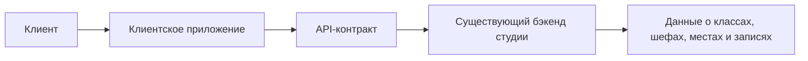
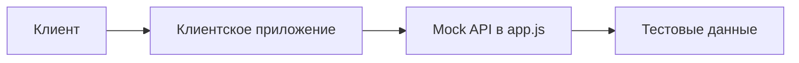
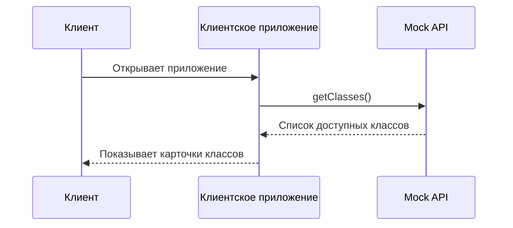
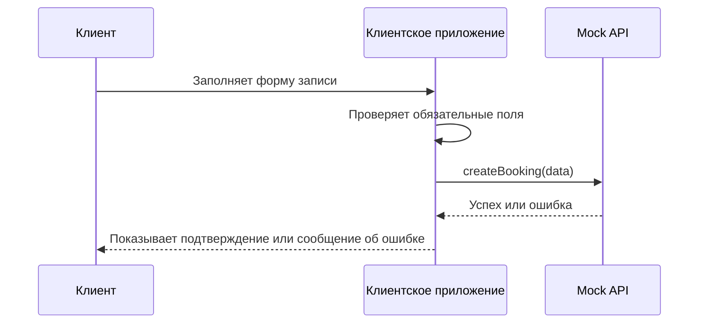

# Архитектурный план — «Кулинарная студия»

## Назначение документа

Документ описывает архитектурный план учебного MVP клиентского приложения кулинарной студии «Шеф-стол».

Архитектурный план показывает, из каких частей состоит решение, как клиентское приложение получает данные, какие экраны входят в MVP и где проходят границы текущей поставки.

---

## 1. Контекст решения

Кулинарная студия «Шеф-стол» проводит групповые кулинарные классы. Клиенту нужно видеть доступные классы, открывать подробную карточку занятия и записываться без переписки с владельцем студии.

По уточнению скоупа текущая работа включает только клиентское мобильное приложение и API для него. Интерфейсы шефа, владельца и администратора уже существуют и не входят в текущую поставку. Данные о слотах, программах и шефах поступают из существующего бэкенда через API.

В учебной реализации настоящий сервер не поднимается. API-запросы имитируются на стороне клиента через mock API в `app.js`.

---

## 2. Общая архитектура

В реальном продукте архитектура выглядит так:



В учебной реализации архитектура упрощается:



---

## 3. Основные части решения

| Компонент | Назначение | Реализация в учебном MVP |
|---|---|---|
| Клиентское приложение | Показывает интерфейс для клиента: список классов, карточку класса, форму записи и статус записи. | `index.html`, `style.css`, `app.js` |
| Mock API | Имитирует запросы к существующему бэкенду. | Функции в `app.js`, возвращающие тестовые данные |
| Тестовые данные | Хранят примеры классов, шефов, программ, свободных мест и записей. | Массивы объектов в `app.js` |
| API-контракт | Описывает, какие данные клиент ожидает от бэкенда. | Фиксируется в документах `data-model.md` и `api-sequence.md` |
| Существующий бэкенд | В реальном продукте является источником истины по расписанию, местам и статусам записей. | В учебном MVP не реализуется |

---

## 4. Основные экраны клиентского приложения

| Экран | Назначение | Связанные требования |
|---|---|---|
| Список кулинарных классов | Показывает доступные классы на ближайшие дни. | FR-001 — FR-005 |
| Карточка класса | Показывает подробности выбранного занятия. | FR-006 — FR-009 |
| Форма записи | Позволяет клиенту отправить запись на выбранный класс. | FR-010 — FR-021 |
| Подтверждение записи | Показывает результат успешной записи и статус. | FR-014, FR-025 |
| Состояние ошибки | Показывает понятное сообщение, если данные не загрузились или запись невозможна. | FR-037 — FR-040 |
| Пустое состояние | Показывает сообщение, если доступных классов нет. | FR-004 |

---

## 5. Пользовательский поток MVP

Основной поток клиента:

1. Клиент открывает приложение.
2. Приложение загружает список доступных кулинарных классов.
3. Клиент выбирает подходящий класс.
4. Приложение открывает подробную карточку класса.
5. Клиент нажимает кнопку «Записаться».
6. Приложение открывает форму записи.
7. Клиент вводит контактные данные.
8. Клиент указывает информацию об аллергиях, если это предусмотрено формой.
9. Клиент выбирает вариант по фартуку и набору ножей.
10. Клиент отправляет форму.
11. Mock API имитирует создание записи.
12. Приложение показывает подтверждение или понятную ошибку.

---

## 6. Поток данных

### 6.1. Получение списка классов



### 6.2. Создание записи



---

## 7. Mock API в учебной реализации

Так как настоящий бэкенд в учебной реализации не поднимается, взаимодействие с API имитируется в `app.js`.

Примерная структура mock API:

```js
const api = {
  getClasses() {
    return Promise.resolve(mockClasses);
  },

  getClassById(id) {
    return Promise.resolve(mockClasses.find(item => item.id === id));
  },

  createBooking(data) {
    // Проверка обязательных полей и свободных мест
    // Возврат успешного результата или ошибки
  }
};
```

Такой подход позволяет:

- показать архитектурное разделение между интерфейсом и источником данных;
- имитировать реальные API-запросы;
- тестировать успешные и ошибочные сценарии;
- не тратить время на отдельный сервер в учебном MVP.

---

## 8. Границы ответственности

### Клиентское приложение отвечает за:

- отображение списка классов;
- отображение карточки класса;
- отображение формы записи;
- проверку обязательных полей формы;
- отправку данных записи в mock API;
- отображение результата записи;
- отображение ошибок и пустых состояний.

### Mock API отвечает за:

- предоставление тестовых данных;
- имитацию получения списка классов;
- имитацию получения карточки класса;
- имитацию создания записи;
- имитацию ошибки при отсутствии свободных мест.

### Существующий бэкенд в реальном продукте отвечает за:

- хранение расписания;
- хранение программ классов;
- хранение данных о шефах;
- проверку свободных мест;
- создание и изменение статусов записей;
- обработку отмены класса студией.

---

## 9. Что не входит в архитектуру MVP

В текущую архитектуру не входят:

- админка;
- интерфейс владельца;
- интерфейс шефа;
- создание и редактирование расписания;
- назначение шефов на классы;
- управление программами классов;
- управление закупками продуктов;
- онлайн-оплата;
- программа лояльности;
- реальная серверная база данных;
- отдельный backend-сервис для учебной реализации.

---

## 10. Основные данные, с которыми работает клиент

Клиентское приложение использует следующие группы данных:

| Группа данных | Описание |
|---|---|
| Кулинарный класс | Конкретное занятие в расписании. |
| Программа класса | Описание меню и уровня сложности. |
| Шеф | Данные о ведущем класса. |
| Свободные места | Количество доступных рабочих мест или статус доступности. |
| Запись клиента | Данные заявки клиента на участие. |
| Аллергии | Информация, которую клиент может указать перед занятием. |
| Фартук и ножи | Выбор клиента: свой комплект или комплект студии. |
| Статус записи | Подтверждена, отменена клиентом, отменена студией, завершена. |

---

## 11. Риски и ограничения

| Риск / ограничение | Как учитывается |
|---|---|
| Нет настоящего API | Используется mock API в `app.js`. |
| Данные могут отличаться от будущего реального API | В `data-model.md` фиксируется ожидаемый API-контракт. |
| Свободные места в реальном продукте должен проверять бэкенд | В учебной реализации проверка имитируется, но в документации зафиксировано, что источник истины — бэкенд. |
| Некоторые функции не подтверждены как часть MVP | Они помечаются как требующие уточнения или выносятся после MVP. |
| Онлайн-оплата не подтверждена | Не включается в архитектуру MVP. |

---

## 12. Итог

Архитектура учебного MVP построена вокруг простого клиентского приложения с имитацией API-запросов.

Решение не требует отдельного сервера и позволяет реализовать основные фичи:

1. список кулинарных классов;
2. карточку выбранного класса;
3. форму записи;
4. обработку ошибок;
5. отображение статуса записи.

Такой подход соответствует учебной задаче: показать умение работать с требованиями, проектировать решение, использовать ИИ в разработке и реализовать минимальный работающий клиентский MVP.