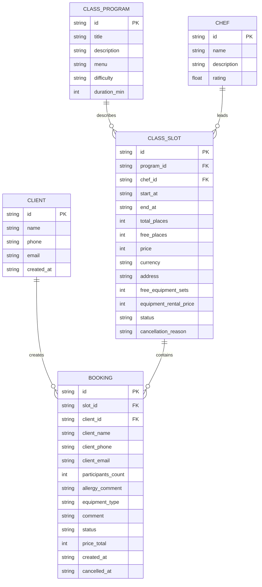
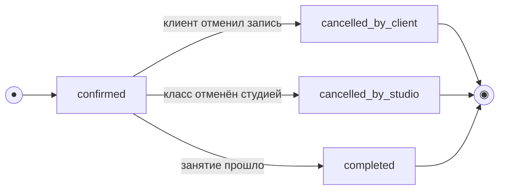
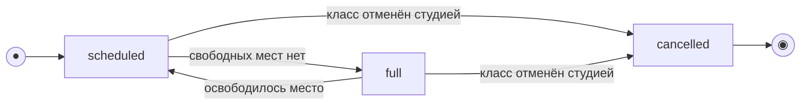

# Модель данных

> Этап 3. Проектирование. Описание сущностей, атрибутов и связей + черновик ERD.
>
> **Скоуп: клиентское приложение и API для него.** Это **ресурсная модель API**: описание данных,
> которые клиентское приложение читает и отправляет через API.
>
> Модель не является физической схемой базы данных. Хранение, серверная бизнес-логика,
> проверка свободных мест и управление расписанием принадлежат существующему бэкенду.
>
> В учебной реализации настоящий бэкенд не поднимается: API-запросы имитируются в клиентском коде
> через mock API и тестовые данные в `app.js`.

---

## Сущности и атрибуты

### Client / Клиент

| Атрибут | Тип | Описание |
| :-- | :-- | :-- |
| `id` | UUID | Идентификатор клиента. В учебном MVP может не использоваться |
| `name` | string | Имя клиента |
| `phone` | string | Телефон для связи |
| `email` | string? | Email клиента, если он нужен для подтверждений или уведомлений |
| `created_at` | datetime? | Дата создания клиента, если клиент хранится в системе |

> В MVP полноценная авторизация клиента не обязательна. Для записи достаточно контактных данных,
> которые клиент вводит в форме.

---

### ClassProgram / Программа кулинарного класса

| Атрибут | Тип | Описание |
| :-- | :-- | :-- |
| `id` | UUID | Идентификатор программы |
| `title` | string | Название программы |
| `description` | string | Описание занятия |
| `menu` | string[] | Список блюд или тем, которые входят в занятие |
| `difficulty` | enum? | Уровень сложности, если он используется в интерфейсе |
| `duration_min` | int | Длительность занятия в минутах |

> Программа класса приходит из существующего бэкенда и является read-only для клиентского
> приложения. Клиент не создаёт и не редактирует программы.

---

### Chef / Шеф

| Атрибут | Тип | Описание |
| :-- | :-- | :-- |
| `id` | UUID | Идентификатор шефа |
| `name` | string | Имя шефа |
| `description` | string? | Краткое описание опыта или специализации |
| `rating` | number? | Средняя оценка шефа, если функция рейтинга будет включена |

> Оценка шефа упомянута в брифе как желательная функция, но для MVP может быть вынесена за
> рамки первой версии. Поэтому `rating` не является обязательным полем.

---

### ClassSlot / Слот кулинарного класса

| Атрибут | Тип | Описание |
| :-- | :-- | :-- |
| `id` | UUID | Идентификатор слота |
| `program_id` | FK → ClassProgram | Программа занятия |
| `chef_id` | FK → Chef | Шеф, который ведёт занятие |
| `start_at` | datetime | Дата и время начала занятия |
| `end_at` | datetime? | Дата и время окончания занятия |
| `total_places` | int | Общее количество мест на занятии |
| `free_places` | int | Количество свободных мест |
| `price` | money | Стоимость участия |
| `currency` | string | Валюта, например `RUB` |
| `address` | string | Адрес или зал проведения занятия |
| `free_equipment_sets` | int? | Количество доступных комплектов студии: фартук и набор ножей |
| `equipment_rental_price` | money? | Стоимость комплекта студии, если прокат платный |
| `status` | enum | Статус слота: `scheduled`, `full`, `cancelled` |
| `cancellation_reason` | string? | Причина отмены, если класс отменён студией |

> `ClassSlot` — read-only-проекция существующего расписания. Клиентское приложение только получает
> слот через API и не редактирует дату, шефа, программу, количество мест или статус.

---

### Booking / Запись клиента

| Атрибут | Тип | Описание |
| :-- | :-- | :-- |
| `id` | UUID | Идентификатор записи |
| `slot_id` | FK → ClassSlot | Слот, на который записался клиент |
| `client_id` | FK → Client? | Клиент, если он хранится как отдельная сущность |
| `client_name` | string | Имя клиента из формы записи |
| `client_phone` | string | Телефон клиента |
| `client_email` | string? | Email клиента |
| `participants_count` | int | Количество участников в записи |
| `allergy_comment` | string? | Информация об аллергиях или пищевых ограничениях |
| `equipment_type` | enum | Вариант: `own` или `studio` |
| `comment` | string? | Дополнительный комментарий клиента |
| `status` | enum | Статус записи |
| `price_total` | money? | Итоговая стоимость, если она возвращается API |
| `created_at` | datetime | Дата и время создания записи |
| `cancelled_at` | datetime? | Дата и время отмены, если запись отменена |

> В учебном MVP `Booking` создаётся через mock API. В реальном продукте проверка свободных мест
> и финальное создание записи выполняются на стороне бэкенда.

---

## Статусы

### Статусы ClassSlot

| Статус | Описание |
| :-- | :-- |
| `scheduled` | Класс запланирован и доступен для просмотра |
| `full` | Свободных мест нет |
| `cancelled` | Класс отменён студией |

> Статус `full` может быть отдельным статусом или вычисляться из условия `free_places = 0`.
> Для учебного MVP допустимо использовать вычисление на стороне mock API.

---

### Статусы Booking

| Статус | Описание |
| :-- | :-- |
| `confirmed` | Запись создана и подтверждена |
| `cancelled_by_client` | Клиент отменил свою запись |
| `cancelled_by_studio` | Класс отменён студией, запись закрыта не по инициативе клиента |
| `completed` | Класс прошёл |

> Статус `completed` может быть не хранимым значением, а производным отображением по дате занятия.
> В MVP это можно реализовать упрощённо.

---

## ERD



---

## Модель состояний

### Booking / Запись клиента



| Из | Событие / условие | В | Комментарий |
| :-- | :-- | :-- | :-- |
| — | Клиент успешно отправил форму записи | `confirmed` | Запись создана |
| `confirmed` | Клиент отменяет запись | `cancelled_by_client` | Возможность отмены зависит от правил студии |
| `confirmed` | Студия отменяет класс | `cancelled_by_studio` | Запись не удаляется, а получает отдельный статус |
| `confirmed` | Дата занятия прошла | `completed` | Может быть производным отображением |

---

### ClassSlot / Слот кулинарного класса



| Статус | Что видит клиент | Запись доступна |
| :-- | :-- | :-- |
| `scheduled` | Класс отображается как доступный | Да, если `free_places > 0` |
| `full` | Класс отображается с пометкой «Мест нет» | Нет |
| `cancelled` | Класс отображается как отменённый или скрывается из списка доступных | Нет |

---

## Ключевые инварианты

- `ClassSlot.free_places` не может быть меньше `0`.
- `Booking.participants_count` не может быть больше количества свободных мест на момент создания записи.
- Если `ClassSlot.free_places = 0`, клиент не должен успешно создать новую запись.
- Если клиент выбирает комплект студии, должен быть доступен хотя бы один комплект: `free_equipment_sets > 0`.
- В реальном продукте источник истины по свободным местам, статусам и созданию записи — бэкенд.
- В учебном MVP эти проверки имитируются в `app.js` через mock API.
- Клиентское приложение не создаёт и не редактирует расписание.
- Отмена класса студией не удаляет запись клиента, а переводит её в статус `cancelled_by_studio`.
- Онлайн-оплата, программа лояльности и полноценный рейтинг шефа не входят в обязательный MVP.

---

## Пример ресурса ClassSlot для mock API

```js
const classSlot = {
  id: "slot_001",
  program_id: "program_001",
  chef_id: "chef_001",
  start_at: "2026-07-12T18:00:00",
  end_at: "2026-07-12T21:00:00",
  total_places: 12,
  free_places: 5,
  price: 3500,
  currency: "RUB",
  address: "Кулинарная студия «Шеф-стол», зал 1",
  free_equipment_sets: 4,
  equipment_rental_price: 300,
  status: "scheduled"
};
```

---

## Пример ресурса Booking для mock API

```js
const booking = {
  id: "booking_001",
  slot_id: "slot_001",
  client_name: "Анна",
  client_phone: "+7 900 000-00-00",
  client_email: "anna@example.com",
  participants_count: 1,
  allergy_comment: "Аллергия на орехи",
  equipment_type: "studio",
  comment: "Буду впервые на мастер-классе",
  status: "confirmed",
  price_total: 3800,
  created_at: "2026-07-05T14:30:00"
};
```

---

## Что не входит в модель данных MVP

- Физическая структура базы данных.
- Миграции и серверные таблицы.
- Админка и интерфейс владельца.
- Интерфейс шефа.
- Управление расписанием.
- Управление закупками продуктов.
- Онлайн-оплата.
- Программа лояльности.
- Подробная система рейтингов и отзывов.

---

## Итог

Модель данных фиксирует минимальный набор ресурсов, необходимых клиентскому приложению:

1. получить список кулинарных классов;
2. открыть карточку выбранного класса;
3. создать запись клиента;
4. передать информацию об аллергиях;
5. указать вариант по фартуку и набору ножей;
6. получить статус записи.

В учебной реализации эти данные используются как основа для mock API в `app.js`.